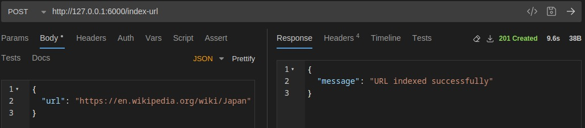
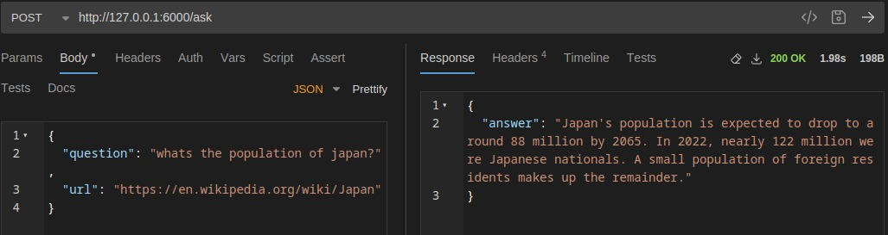
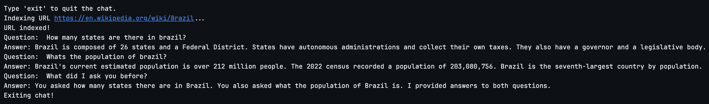

# Talk with your URLs

This project allows an user to index URLs and send questions to a LLM about the contents of a indexed URL.

## Architecture

URLs are ingested via the `index-url` endpoint. The pipeline does a GET request on the URL, strips the HTML tags and irrelevant content, splits the page content into chunks and calls the embedder model for each of this chunks.

Embeddings are stored in memory using [ChromaDB](docs.trychroma.com) and are persisted in disk on `data/chromadb/` to allow for multiple executions without needing to re-index the URLs. Each embedding also has the URL as a metadata, allowing to filter them when using the `ask` endpoint.

Users are them able to have the LLM answer questions based on a URL. This is accomplished by filtering by URL and retrieving the relevant documents, we then use this information to enhance the prompt to the LLM. The prompt also has instructions to only answer based on the context, i.e., the information retrieved from the URL.

For text completions and embeddings, we are using the models provided by Google ([gemini-2.0-flash-lite](https://ai.google.dev/gemini-api/docs/models#gemini-2.0-flash-lite) and [text-embedding-004](https://ai.google.dev/gemini-api/docs/models#text-embedding)), thus **running this project requires a Google API Key**.

## Endpoints

### `index-url` endpoint
```
curl --request POST \
  --url http://127.0.0.1:6000/index-url \
  --header 'content-type: application/json' \
  --data '{
  "url": "https://en.wikipedia.org/wiki/Japan" 
}'
```


### `ask` endpoint
```
curl --request POST \
  --url http://127.0.0.1:6000/ask \
  --header 'content-type: application/json' \
  --data '{
  "question": "whats the population of japan?",
  "url": "https://en.wikipedia.org/wiki/Japan"
}'
```


# Running
This project uses [uv](https://docs.astral.sh/uv/) for package managing, install it to run the following steps:
- Install the required packages: `uv sync`.
- Set up the `GOOGLE_API_KEY` environment variable, e.g. `export GOOGLE_API_KEY=<your-key-here>`
- Start the API locally: `uv run asgi.py`, this will launch a uvicorn server that listens on `http://0.0.0.0:6000`.

## Dockerfile
A Dockerfile is also provided, allowing running on different systems. To run, follow the steps:
- Build the image: `docker build -t rag_app .`
- Run the image, binding to port 6000 on the host: `docker run --rm -p 6000:6000 -e GOOGLE_API_KEY=<your-key-here> rag_app`

## Chat example
`chat.ipynb` contains a chat-like simulation using what was developed for the API. In addition, this interface keeps track of the interaction between the user and the LLM and sends this information to the LLM, so its possible to follow-up on questions or to ask what was asked previously.

